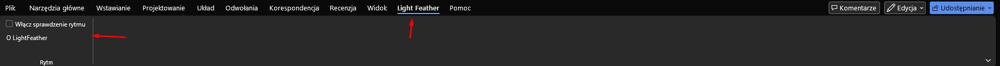
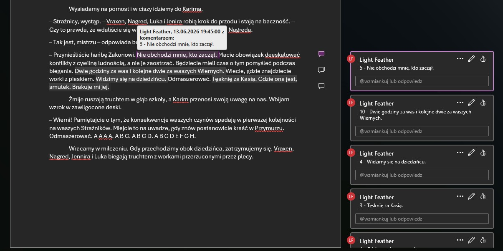

# LightFeather

**LightFeather** is a Microsoft Word add-in (VSTO) built for writers who want to improve the rhythm and flow of their prose.

## Features

### ✍️ Rhythm Checker

A real-time writing assistant that analyses sentence length patterns in your document.

- **How it works:** Every second, LightFeather examines the paragraph your cursor is currently in. It counts the number of words in each sentence and compares consecutive sentences. If two adjacent sentences have a similar word count (difference of ≤ 2 words), it flags them as having a monotonous rhythm — a common issue that makes prose feel repetitive.
- **Flagging:** Problematic sentences are annotated with Word comments authored by *"Light Feather"*, showing the word count so the writer can quickly spot and fix the rhythm issue.
- **Toggle on/off:** Rhythm checking can be enabled or disabled directly from the LightFeather ribbon tab in Word. When disabled (or when Word closes), all comments added by the add-in are automatically removed, leaving the document clean.

## Technology Stack

| Component | Details |
|-----------|---------|
| Platform | Microsoft Word Add-in (VSTO) |
| Language | C# (.NET Framework 4.7.2) |
| Office API | Microsoft.Office.Interop.Word 15.0 |
| Tooling | Visual Studio Tools for Office (VSTO 4.0) |

## Requirements

- Microsoft Word 2013 or later
- .NET Framework 4.7.2
- Microsoft Visual Studio Tools for Office Runtime 4.0

## Installation

1. Download the latest release from the `publish/` directory.
2. Run `setup.exe`. It will install the required runtimes and register the add-in with Word.
3. After installation, a **LightFeather** tab will appear in the Word ribbon.

## Building from Source

1. Open `LightFeather.sln` in Visual Studio (2019 or later recommended).
2. Restore any missing references (VSTO and Office Interop assemblies must be available).
3. Build the solution (`Debug` or `Release` configuration).
4. Press **F5** to launch Word with the add-in loaded for debugging.

## Usage

1. Open any document in Microsoft Word.
2. Navigate to the **LightFeather** ribbon tab.
3. Check the **Rhythm** checkbox to enable real-time rhythm analysis.
4. Write or edit text (sentences with suspiciously similar lengths to their neighbours will be highlighted via Word comments).
5. Uncheck the **Rhythm** checkbox to disable analysis and remove all add-in comments.

## License

This project is provided as-is for personal and educational use.
